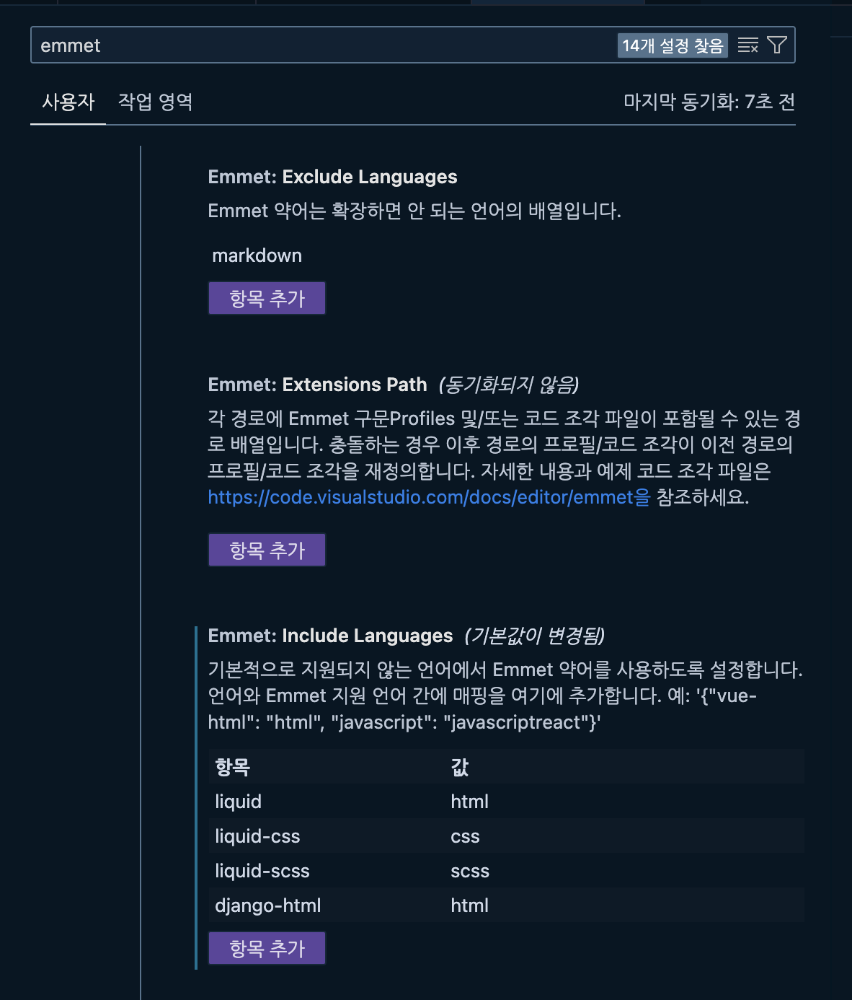
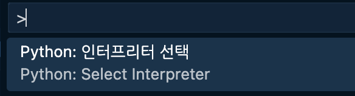
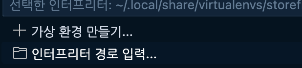

# Django 환경 설정

## 가상환경(pipenv) 설정

### pipenv 설치
```shell
➜  brew install pipenv
```

### .zshrc 에 가상환경 환경변수 설정
```shell
export PIPENV_IGNORE_VIRTUALENVS=1
export PIPENV_VERBOSITY=-1
```

### 가상환경 생성 및 활성화
```shell
# 이전 가상환경을 빠져나오려면 exit
➜  mkdir core && cd core
➜  pipenv install
➜  pipenv shell
```

### 장고 프로젝트 생성
```shell
➜  django-admin startproject core .
```

### django 설치
```shell
➜  pipenv install django
Installing django...
Resolving django...
✔ Installation Succeeded
Installing dependencies from Pipfile.lock (e35515)...
To activate this project's virtualenv, run pipenv shell.
Alternatively, run a command inside the virtualenv with pipenv run.
bm in python-wsgi/django-01/core
```

### 서버 실행
```shell
# manage.py 는 django-admin 래퍼이고 현재 프로젝트의 정보를 알고 있음
➜  python3 manage.py runserver 9000
```

## 디버그 툴바 설치

```shell
➜  pipenv install django-debug-toolbar
```
https://django-debug-toolbar.readthedocs.io/en/latest/

<br>
<br>

# Post App
## post app 생성
```shell
python3 manage.py startapp posts
```
## /core/sattiings.py 에 app 등록
```python
INSTALLED_APPS = [
    ...
    'posts',
    ...
]
```
## /posts/urls.py 새성하고 app url 등록
```python
from . import views
from django.urls import path

app_name = 'posts'

# URLConf
urlpatterns = [
    path("", views.posts_list, name="list"),
    path("<slug:slug>", views.post_page, name="page"),
]
```

## /core/urls.py 에 app url 등록
```python
from . import views
from django.conf.urls.static import static
from django.conf import settings

urlpatterns = [
    ...
    path("posts/", include("posts.urls")),
]
```


## /posts/views.py 에 함수 생성
```python
from django.shortcuts import render
from .models import Post
from django.http import HttpResponse


# Create your views here.
def posts_list(request):
    posts = Post.objects.all().order_by("-date")
    return render(request, "posts/posts_list.html") #, {"posts": posts})


def post_page(request, slug):
    post = Post.objects.get(slug=slug)
    return render(request, "posts/post_page.html") #, {"post": post})
```

## /posts/templates/posts/posts_list.html 생성
```html



  Posts



  <section>
    <h1>Posts</h1>
    
      <article class="post">
        <h2>
          <a href="">
            {{ post.title }}
          </a>
        </h2>
        <p>{{ post.date }}</p>
        <p>{{ post.body }}</p>
      </article>
    
  </section>

...

## /posts/templates/posts/post_page.html 생성
```html



  {{ post.title }}



  <section>
    <article class="post">
      <h1>{{ post.title }}</h1>
      <p>{{ post.date }}</p>
      <p>{{ post.body }}</p>
    </article>
  </section>

```

## 서버 띄워서 확인
```shell
➜  python3 manage.py runserver 9000
```

## /posts/models.py 에 모델 생성
```python


## 마이그레이션
```shell
➜  python3 manage.py migrate
```

## 모델 생성
```python
from django.db import models

class Post(models.Model):
    title = models.CharField(max_length=100)
    content = models.TextField()
    created_at = models.DateTimeField(auto_now_add=True)
    updated_at = models.DateTimeField(auto_now=True)
```

## 마이그레이션 생성
```shell
➜  ➜  python3 manage.py makemigrations
Migrations for 'posts':
  posts/migrations/0001_initial.py
    - Create model Post
```

## 마이그레이션 적용
```shell
➜  python3 manage.py migrate
```

## 슈퍼유저 생성
```shell
➜  python3 manage.py createsuperuser # codelab
```


## collectstatic
```shell
➜  python3 manage.py collectstatic
```


# 참고
https://youtu.be/rHux0gMZ3Eg?si=1OhVht_QuDMupclV \
https://youtu.be/5DW4Ky1Um4o?si=VznNDbDYjZXgPmwZ \
https://www.djangoproject.com \
https://dev.to/earthcomfy/django-code-formatting-and-linting-made-easy-a-step-by-step-pre-commit-hook-tutorial-592f
https://code.visualstudio.com/docs/python/formatting \
https://youtu.be/Rp5vd34d-z4?si=scj-d12pl1M7nvtC


## VS code 설정 변경
Django Template Language (DTL) 파일을 HTML 파일로 인식하도록 설정 변경


### 가상환경 경로 설정
```shell
# 가상환경 경로 확인
➜  pipenv --venv
/Users/bm/.local/share/virtualenvs/core-RSO5XgiL
```





> 파이썬 인터프리터 경로 설정 \
/Users/bm/.local/share/virtualenvs/core-RSO5XgiL/bin/python
