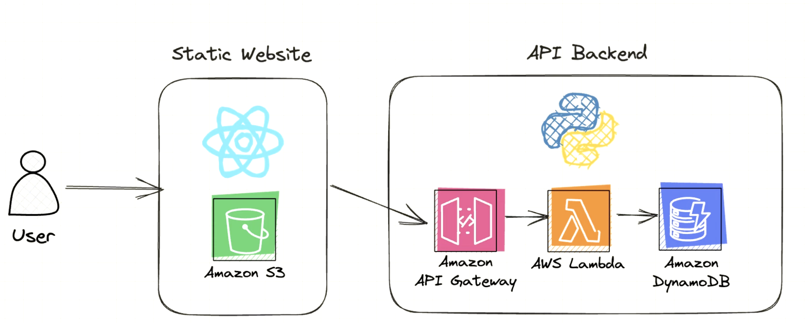

# AWS CDK
```shell
# Install AWS CDK
➜  brew install aws-cdk  # -- I chose this way
➜  npm install -g aws-cdk # -- Or this way
➜  cdk --version

# cdk init
➜  mkdir infra && cd infra
➜  cdk init app --language typescript

# cdk bootstrap
# Only once per account and region
➜  cdk bootstrap --region ap-northeast-2
```

```typescript
// infra/lib/cdk-stack.ts
import * as cdk from 'aws-cdk-lib';
import { Construct } from 'constructs';
import * as s3 from 'aws-cdk-lib/aws-s3';

export class CdkStack extends cdk.Stack {
  constructor(scope: Construct, id: string, props?: cdk.StackProps) {
    super(scope, id, props);

    const bucket = new s3.Bucket(this, 'codelabBucket', {});
  }
}
```

```shell
➜  cdk deploy
➜  aws s3 ls
```


# Github Actions

https://2hjb7n3mbgopfw6377alzhdokm0dqfoy.lambda-url.ap-northeast-2.on.aws/

```shell
mkdir -p .github/workflows
touch .github/workflows/deploy_beta.yml
```

```yaml
name: Deploy to AWS (CDK)

on:
  push:
    branches:
      - feature

jobs:
  deploy:
    runs-on: ubuntu-latest

    steps:
      - name: Checkout code
        uses: actions/checkout@v2

      - name: Setup Node.js
        uses: actions/setup-node@v2
        with:
          node-version: 18

      - name: Install AWS CDK
        run: npm ci

      - name: Deploy CDK
        working-directory: ./
        run: npx cdk deploy --require-approval never
        env:
          AWS_ACCESS_KEY_ID: ${{ secrets.BETA_AWS_ACCESS_KEY_ID }}
          AWS_SECRET_ACCESS_KEY: ${{ secrets.BETA_AWS_SECRET_ACCESS_KEY }}
          AWS_REGION: ${{ secrets.BETA_AWS_REGION }}
```

github secrets 설정 \
https://github.com/codelab-kr/aws-cdk-action/settings/secrets/actions - new repository secret

```shell
BETA_AWS_ACCESS_KEY_ID
BETA_AWS_SECRET_ACCESS_KEY
BETA_AWS_REGION
```

```shell
git add .
git commit -m "Add github actions"
git push origin feature
```

# Auto Increment Version
```shell
cd cdk-action/.git/hooks && cp pre-commit.sample pre-commit
```

```shell
vi pre-commit
#!/bin/bash
# .env 파일에서 VERSION 값을 읽어옵니다.
VERSION=$(sed -n 's/VERSION="\([^"]*\)"/\1/p' .env)

if [[ -n "$VERSION" ]]; then
	# 버전을 증가시킵니다.
	IFS='.' read -ra ADDR <<< "$VERSION"
	last_index=$(( ${#ADDR[@]}-1 ))
	ADDR[last_index]=$((${ADDR[last_index]} + 1))
	NEW_VERSION=$(IFS=.; echo "${ADDR[*]}")

	# .env 파일에서 이전 버전을 새 버전으로 교체합니다.
	perl -pi -e "s/$VERSION/$NEW_VERSION/g" .env
	echo "New version: $NEW_VERSION"

	# 변경된 .env 파일을 git에 추가합니다.
	git add .env
fi
```

```shell
git add .
git commit -m "Add auto increment version"
New version: 1.1
[feature a65ebe9] add version
 7 files changed, 66 insertions(+), 7 deletions(-)
 create mode 100644 .env
 create mode 100755 pre-commit
```
<br>

# Django serverless
## (optional) Local Installation
```shell
pipenv install
pipenv shell
> python 인터프리터 선택
python3 manage.py runserver # chack if it works
(optional) pipenv run pip freeze > requirements.txt
```
fastapi 최신 버전에서 에러가 발생함 (2024.5.10. 현재)

## Propare to Deploy FastAPI to AWS Lambda
```shell
cd lambda
pipenv run pip install -t dependencies -r requirements.txt

(cd dependencies; zip ../aws_lambda_artifact.zip -r .)

zip aws_lambda_artifact.zip -u main.py
zip aws_lambda_artifact.zip -u books.json
```

lib/cdk-action-stack.ts
```typescript
...
 const lambdaFunction = new lambda.Function(this, 'LambdaFunction', {
      runtime: lambda.Runtime.PYTHON_3_12,
      code: lambda.Code.fromAsset('lambda/aws_lambda_artifact.zip'),
      handler: 'main.handler',
...


```

```typescript
// infra/lib/infra-stack.ts
import * as cdk from 'aws-cdk-lib';
import { Construct } from 'constructs';
import * as lambda from 'aws-cdk-lib/aws-lambda';

export class CdkActionStack extends cdk.Stack {
  constructor(scope: Construct, id: string, props?: cdk.StackProps) {
    super(scope, id, props);

    const lambdaFunction = new lambda.Function(this, 'LambdaFunction', {
      runtime: lambda.Runtime.PYTHON_3_12,
      code: lambda.Code.fromAsset('lambda'),
      handler: 'main.handler'
    });

    const functionUrl = lambdaFunction.addFunctionUrl({
      authType: lambda.FunctionUrlAuthType.NONE,
      cors: {
        allowedOrigins: ['*'],
        allowedMethods: [lambda.HttpMethod.ALL],
        allowedHeaders: ['*']
      }
    });

    new cdk.CfnOutput(this, 'Url', {
      value: functionUrl.url
    });
  }
}
```

```shell
mkdir lambda && cd lambda
touch main.py

# main.py
def handler(event, context):
    return {
        "statusCode": 200,
        "body": "Hello World"
    }
```

```shell
cd ..
cdk deploy
...
```


## Deploy FastAPI to AWS Lambda
```shell
git add .
git commit -m "Deploy FastAPI to AWS Lambda"
git push
```



https://youtu.be/7-CvGFJNE_o?si=6vDNWKTp2ZtmNWp8


# Reference
- Youtube @pixegami \
https://youtu.be/9uMcN66mfwE?si=IKGoJFjPRCcLLbzj
---


<br>
